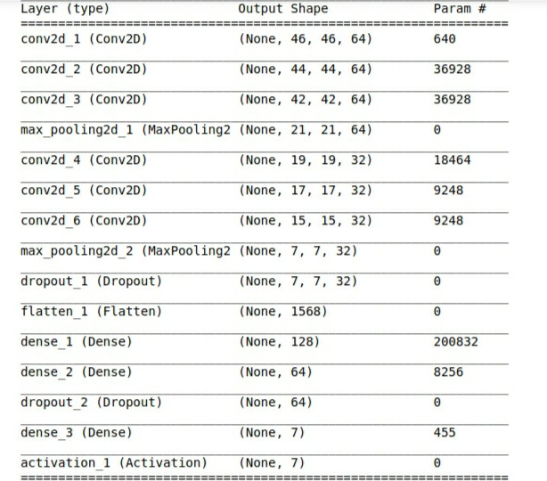
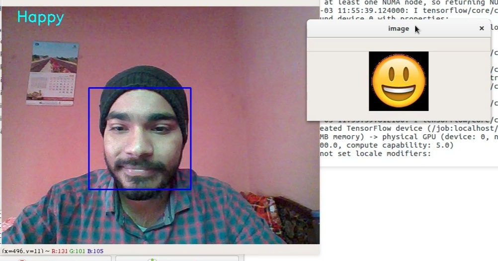
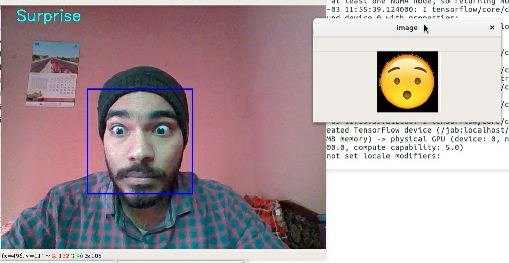

#Facial Emotion Detection

This repository is the out project about mood recognition using convolutional neural network.

## Dataset

We use the [FER-2013](http://www.socsci.ru.nl:8180/RaFD2/RaFD?p=main) Faces Database, a set of 28,709 pictures of people displaying 7 emotional expressions (angry, disgusted, fearful, happy, sad, surprised and neutral). The dataset quality and image diversity is not very good and you will probably get a model with bad accuracy in other applications!

You have to request for access to the dataset or you can get it on [Kaggle](https://www.kaggle.com/c/challenges-in-representation-learning-facial-expression-recognition-challenge/data). Download fer2013.tar.gz and decompress fer2013.csv in the ./data folder.

## Building a CNN Model

1. Read csv file 
2. Extract labels and pixel values of each image
3. categorise dataset into training and test set
4. Build a cnn model
5. Fit model on training data
6. Analyse and evaluate model on test data
7. Save the weights of the model

	** Our Model **
    
    

## Using Open-cv for Live Emotion Detection

1. Load our saved Model
2. Use pretrained xml file to detect face
3. resize face image for testing on model
4. Predict output

## Output

## Dependencies
- Keras 2.2.4
- Tensorflow 1.1.10
- Numpy
- pandas
- Matplotlib
- Opencv
- h5py